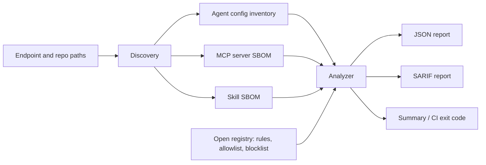
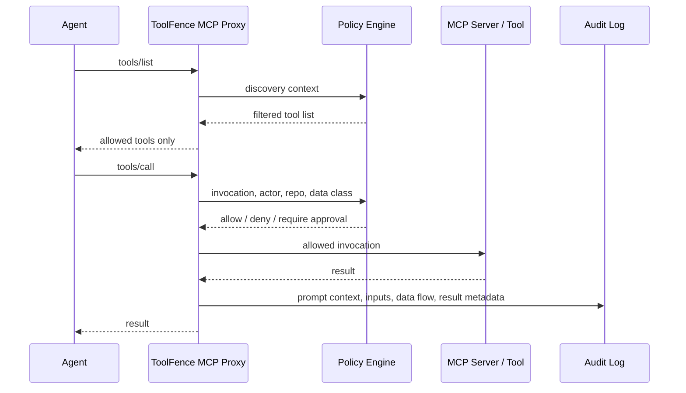

# Architecture

ToolFence is organized around one durable asset model that works for scanning
and future runtime enforcement.

## V1 Scanner

V1 components:

- `toolfence.discovery`: finds agent configs, MCP servers, and skills.
- `toolfence.models`: normalized endpoint SBOM and finding schema.
- `toolfence.analyzers`: applies signatures, allowlists, blocklists, and
  heuristics.
- `toolfence.reporting`: renders summary, JSON, and SARIF.
- `rules/`: open registry for signatures, allowlist, blocklist, and policy
  templates.

The scanner avoids storing secret values. MCP `env` values are redacted; reports
keep env key names so reviewers can see that credentials are being passed.

## Discovery Scope

Endpoint-level configs include common locations for:

- Claude Desktop
- Claude Code
- Cursor
- Windsurf
- Codex
- Gemini CLI
- Amazon Q

Project-level configs include:

- `.mcp.json`
- `mcp.json`
- `.cursor/mcp.json`
- `.vscode/mcp.json`
- `.claude/mcp.json`
- `.codex/mcp.json`

Skill roots include common user-level skill directories plus project-local
`skills/`, `.skills/`, `.codex/skills/`, `.claude/skills/`, and `agent/skills/`.

## V2 Runtime Firewall Shape

V2 should reuse:

- V1 SBOM asset IDs and fingerprints.
- `rules/allowlist` and `rules/blocklist` as discovery-time controls.
- `rules/policies/runtime-default.json` as the first event policy contract.
- `rules/runtime/clawguard-runtime.json` as the first command/file/network
  runtime policy template.
- `toolfence.runtime` as the policy, sanitizer, audit, approval, and panic
  engine for the MCP proxy.
- Finding categories as policy authoring templates.

Runtime enforcement should support:

- Discovery-time filtering: hide tools before the model can plan with them.
- Invocation-time policy: ABAC/RBAC against actor, repo, project, data class,
  tool kind, destination, and action risk.
- Per-task scoped permission grants.
- Human approval queue for destructive or external actions.
- Data-flow tracking from read sources to write/egress destinations.
- Full audit and replay.

## V3 Enterprise Control Plane

Enterprise deployment adds:

- Fleet inventory across developer endpoints.
- Central allowlist/blocklist and policy distribution.
- Team, repo, and data-class based policy.
- SIEM/SOC forwarding.
- Compliance reports for SOC2, ISO, and internal audit.
- Risk intelligence feed for MCP servers, skills, maintainers, packages, and
  semantic diffs.
